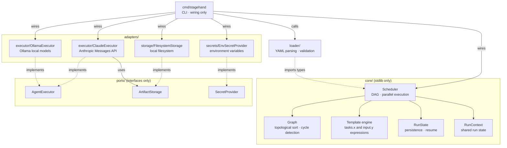

# stagehand

Stagehand orchestrates multi-agent AI workflows defined in YAML. Each workflow is a directed acyclic graph (DAG) of tasks. Tasks with no dependencies run in parallel; tasks with dependencies wait until their upstream tasks complete.

---

## Table of Contents

- [Requirements](#requirements)
- [Installation](#installation)
- [Quickstart](#quickstart)
- [Concepts](#concepts)
  - [Workflow](#workflow)
  - [Agents](#agents)
  - [Tasks](#tasks)
  - [Outputs](#outputs)
  - [Template expressions](#template-expressions)
- [YAML reference](#yaml-reference)
- [CLI reference](#cli-reference)
- [Examples](#examples)
  - [Sequential workflow](#sequential-workflow)
  - [Parallel workflow](#parallel-workflow)
- [Executors](#executors)
- [Architecture](#architecture)
- [Known limitations](#known-limitations)

---

## Requirements

- Go 1.24+
- An API key for your chosen executor (see [Executors](#executors))

## Installation

```bash
git clone https://github.com/janmarkuslanger/stagehand
cd stagehand
go install ./cmd/stagehand
```

Set your API key (see [Executors](#executors)):

```bash
export ANTHROPIC_API_KEY=sk-ant-...
```

---

## Quickstart

```bash
# Validate a workflow and print its execution plan
stagehand plan examples/sequential/workflow.yaml

# Run it
stagehand run examples/sequential/workflow.yaml

# Check the result of a previous run
stagehand status sh-20240503-1a2b
```

---

## Concepts

### Workflow

A workflow is a YAML file that describes a set of agents and tasks. It has a `name`, an optional `version`, and an `output` block that says where generated files are stored.

```yaml
name: "My Workflow"
version: "1"

output:
  backend: filesystem
  path: ./artifacts
```

`output.path` is the root directory where all task artifacts are written. If omitted, stagehand defaults to `.stagehand/runs/<run-id>`.

---

### Agents

An agent is a named AI persona. Each agent has a role, a system prompt, a model, and a list of tools it is allowed to use.

```yaml
agents:
  writer:
    role: "Content writer"
    system_prompt: "You are a concise technical writer."
    model: claude-opus-4-7   # model ID understood by the executor
    executor: claude         # which AI backend to use (see Executors)
    tools:
      - write_file
      - read_file
      - list_files
```

| Field | Required | Description |
|---|---|---|
| `role` | yes | Short label describing the agent's function |
| `executor` | yes | AI backend to use: `claude` or `ollama` (see [Executors](#executors)) |
| `system_prompt` | no | Instructions sent to the model at the start of every request |
| `model` | no | Model identifier passed to the executor. The default depends on the executor used. |
| `tools` | no | List of built-in tools the agent may call |

**Built-in tools**

| Tool | What it does |
|---|---|
| `write_file` | Writes text content to a file under the output directory |
| `read_file` | Reads a file the agent previously wrote |
| `list_files` | Lists files matching a glob pattern |

---

### Tasks

A task is a single unit of work assigned to an agent. Tasks form the nodes of the DAG.

```yaml
tasks:
  draft:
    agent: writer
    prompt: "Write a short introduction to Go."
    outputs:
      - intro.md

  review:
    agent: writer
    depends_on: [draft]
    prompt: "Review this draft and improve it: {{ tasks.draft }}"
    outputs:
      - intro-final.md
```

| Field | Required | Description |
|---|---|---|
| `agent` | yes | Name of the agent that runs this task |
| `prompt` | yes | User message sent to the agent (supports template expressions) |
| `depends_on` | no | List of task names this task waits for |
| `outputs` | no | Declares what files the task produces (see [Outputs](#outputs)) |

Tasks with no `depends_on` (or whose dependencies are all complete) run immediately. Multiple ready tasks run in parallel.

---

### Outputs

The `outputs` field tells stagehand what files a task produces. There are three forms:

**Static list** — the exact file names are known upfront:

```yaml
outputs:
  - report.md
  - summary.md
```

**Dynamic** — the agent decides at runtime what to write:

```yaml
outputs: dynamic
```

**Pattern** — files matching a glob collected after the task finishes:

```yaml
outputs:
  pattern: "pages/**/*.html"
```

---

### Template expressions

Prompts support `{{ }}` expressions to inject values from previous tasks or runtime inputs.

| Expression | Resolves to |
|---|---|
| `{{ input.key }}` | A value passed via `--input key=value` at runtime |
| `{{ tasks.id }}` | The text output of a completed task |
| `{{ tasks.id.files }}` | Newline-separated list of file paths produced by a task |
| `{{ tasks.id.filename_md }}` | Path of a specific file, identified by its slug (`filename.md` → `filename_md`) |

Example:

```yaml
prompt: |
  Here is the draft:
  {{ tasks.draft }}

  The files it produced:
  {{ tasks.draft.files }}
```

---

## YAML reference

```yaml
name: string          # required — workflow display name
version: string       # optional

output:
  backend: filesystem # required if output block is present
  path: string        # directory for artifacts (default: .stagehand/runs/<run-id>)

agents:
  <name>:
    role: string
    executor: string       # required — "claude" or "ollama"
    system_prompt: string
    model: string          # model ID passed to the executor (e.g. claude-opus-4-7, qwen2.5)
    tools:
      - write_file
      - read_file
      - list_files

tasks:
  <name>:
    agent: string           # must match an agent name
    prompt: string          # supports {{ }} template expressions
    depends_on:             # optional list of task names
      - other-task
    outputs:                # one of the three forms:
      - file.md             #   static list
      # or
      # outputs: dynamic
      # or
      # outputs:
      #   pattern: "**/*.md"
    secrets:                # optional list of env var names (planned)
      - MY_API_KEY
```

---

## CLI reference

### `stagehand run <workflow.yaml>`

Executes the workflow. Tasks run in parallel where possible.

```bash
stagehand run workflow.yaml
stagehand run workflow.yaml --input topic="climate change"
```

| Flag | Default | Description |
|---|---|---|
| `--input`, `-i` | — | Runtime input as `key=value` or `key=@file` (can repeat) |

Prints the run ID on start. The run state is saved to `.stagehand/runs/<run-id>.json` on completion.

---

### `stagehand plan <workflow.yaml>`

Validates the workflow and prints the execution order without running anything.

```bash
stagehand plan workflow.yaml
```

---

### `stagehand graph <workflow.yaml>`

Prints the full task dependency graph.

```bash
stagehand graph workflow.yaml
```

---

### `stagehand status <run-id>`

Shows the outcome of a previous run.

```bash
stagehand status sh-20240503-1a2b
```

---

### `stagehand resume <run-id>`

Re-runs a workflow, reusing the results of tasks that already completed successfully.

```bash
# Retry all failed/cancelled tasks; keep everything that succeeded
stagehand resume sh-20240503-1a2b

# Re-run from a specific task and everything downstream of it
stagehand resume sh-20240503-1a2b --from review

# Ignore all previous results; re-run the entire workflow
stagehand resume sh-20240503-1a2b --no-cache
```

| Flag | Default | Description |
|---|---|---|
| `--from` | — | Re-run this task and all tasks that depend on it (directly or transitively) |
| `--no-cache` | false | Ignore all saved results; re-run everything from scratch |

Resume always produces a new run ID. The original run state is preserved.

**How it works:**
1. Loads the saved run state for `<run-id>`
2. Determines which tasks can be reused (completed tasks, or all tasks upstream of `--from`)
3. Pre-populates a new RunContext with the reused results
4. Runs the scheduler — it skips any task already present in the RunContext
5. Saves the new run state under the new run ID

---

## Examples

### Sequential workflow

`examples/sequential/workflow.yaml` — two tasks where the second depends on the first.

```
draft  →  refine
```

The `draft` task writes a haiku. The `refine` task reads the output via `{{ tasks.draft }}` and improves it.

```bash
stagehand run examples/sequential/workflow.yaml
```

Artifacts land in `examples/sequential/output/`.

---

### Parallel workflow

`examples/parallel/workflow.yaml` — two independent tasks run at the same time, then a third merges their output.

```
pros  ─┐
       ├→  summary
cons  ─┘
```

`pros` and `cons` have no dependencies and start immediately in parallel. `summary` waits for both, then combines their output via `{{ tasks.pros }}` and `{{ tasks.cons }}`.

```bash
stagehand run examples/parallel/workflow.yaml
```

Artifacts land in `examples/parallel/output/`.

---

## Executors

An executor is the AI backend that runs each task. Stagehand passes the agent's system prompt, model name, tools, and the resolved prompt to the executor, which drives the model and returns the final text output and any files written.

The executor is declared per agent in the YAML using the required `executor:` field. Different agents in the same workflow can use different executors.

```yaml
agents:
  claude-agent:
    executor: claude
    model: claude-opus-4-7
    # ...
  local-agent:
    executor: ollama
    model: qwen2.5
    # ...
```

### `claude`

Uses the [Anthropic Messages API](https://docs.anthropic.com/en/api/messages). Requires `ANTHROPIC_API_KEY` to be set.

```bash
export ANTHROPIC_API_KEY=sk-ant-...
stagehand run workflow.yaml
```

The executor runs a multi-turn agent loop: it calls the API, dispatches tool calls (`write_file`, `read_file`, `list_files`) to the artifact storage, and repeats until the model stops or 20 steps are reached. The system prompt is cached to reduce token costs on repeated calls.

The `model` field accepts any Anthropic model ID (e.g. `claude-opus-4-7`, `claude-sonnet-4-6`). The default is `claude-opus-4-7`.

### `ollama`

Runs models locally via [Ollama](https://ollama.com). No API key required. Ollama must be running on the machine.

```bash
# Install Ollama and pull a model that supports tool use
ollama pull qwen2.5

stagehand run workflow.yaml
```

| Environment variable | Default | Description |
|---|---|---|
| `OLLAMA_HOST` | `http://localhost:11434` | URL of the Ollama server |

The `model` field accepts any model name known to your Ollama instance (e.g. `qwen2.5`, `llama3.2`, `mistral-nemo`). The default is `qwen2.5`.

**Models with reliable tool use support:** `qwen2.5`, `llama3.1`, `llama3.2`, `mistral-nemo`. Tool use quality varies by model — if a workflow produces no output files, try a different model.

---

### Adding a new executor

Implement the `AgentExecutor` interface in `ports/executor.go`, place the implementation under `adapters/executor/`, and add a `case` for it in `buildSingleExecutor()` in `cmd/stagehand/main.go`. Then declare the new executor name in the `executor:` field of any agent. No other files need to change.

```go
type AgentExecutor interface {
    Execute(ctx context.Context, request ExecutionRequest) (ExecutionResult, error)
}
```

---

## Architecture

Stagehand uses a **ports-and-adapters** (hexagonal) architecture.

### Why this pattern?

Three reasons drove the choice:

1. **Exchangeable AI providers.** The scheduler never calls an AI API directly — it calls the `AgentExecutor` interface. Adding a new provider (e.g. Ollama, OpenAI) means one new file in `adapters/executor/` and one new `case` in `buildSingleExecutor()`. Nothing in `core/` changes.

2. **Testability without infrastructure.** Because `core/` depends only on interfaces, the entire scheduling and template logic is tested with a simple in-memory mock — no API key, no filesystem, no network. Adapters are tested independently via `httptest` and in-memory storage.

3. **Enforced boundaries.** The dependency rule is machine-checkable (`grep` is enough). Infrastructure details cannot bleed into domain logic. This keeps the core stable as the adapter layer grows.

The dependency rule is strict:

```
core/     →  nothing external (stdlib only)
ports/    →  nothing (interfaces only)
adapters/ →  ports/ only
loader/   →  core/ only
cmd/      →  everything (wiring only)
```



| Package | Responsibility |
|---|---|
| `core/` | Domain types, DAG, scheduler, run state, template engine |
| `ports/` | Interface definitions: `AgentExecutor`, `ArtifactStorage`, `SecretProvider` |
| `adapters/executor/` | Executor implementations (e.g. `ClaudeExecutor`) |
| `adapters/storage/` | `FilesystemStorage` — reads and writes files |
| `adapters/secrets/` | `EnvSecretProvider` — reads secrets from environment variables |
| `loader/` | Parses and validates workflow YAML |
| `cmd/stagehand/` | CLI, dependency wiring |

---

## Known limitations

- Secrets declared in the `secrets` field of a task are not yet injected into the agent's environment.
- Tool use quality with local Ollama models varies — results depend on the model chosen.
- Partial artifact tracking for failed tasks (`.stagehand/partial/`) is not yet implemented.
